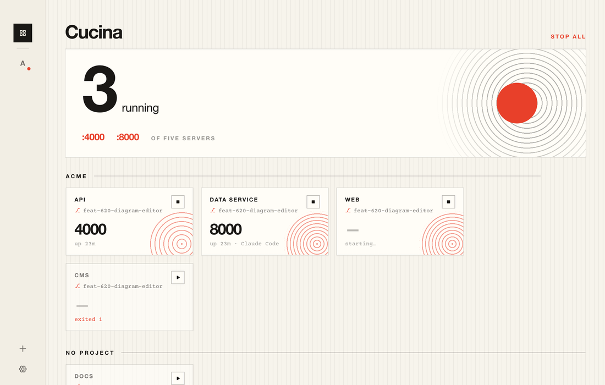
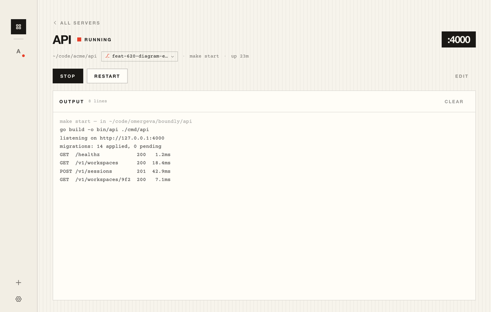

# Cucina

A local dev-server manager for macOS. Point it at a directory and a command, and starting
that server takes one click — from the app, from the menu bar, from the command line, or
from a coding agent.



## Why

Coding agents can start a dev server, but they cannot leave one running: the process dies
with the shell they held open, so you get a background job nobody owns and a port that
stays bound after the agent has moved on.

Cucina takes ownership. An agent hands it a server and walks away — no shell to hold open,
nothing to remember to kill. Whatever it started appears in your menu bar with the agent's
name on it, and you can stop it yourself.

- **One click**, from the app or the menu bar
- **A CLI and an MCP server**, so agents can start, stop, read logs and switch branches
- **Git worktree switching** — move a server between worktrees; it restarts there
- **Projects** — group servers and bring a whole stack up at once
- **Crash-safe** — if Cucina quits, crashes, or is force-killed, its servers die with it
- **Quiet** — no idle polling, no timers, no looping animations; it does nothing when
  nothing is happening

## Requirements

| | |
| --- | --- |
| **Operating system** | macOS 11 Big Sur or later. **macOS only** — see [Platform support](#platform-support). |
| **Architecture** | Released builds are **Apple Silicon (arm64) only**. Intel Macs need to build from source. |
| **Signing** | Released builds are **not notarized**. macOS will block them until you clear the quarantine flag — see below. |
| **To build** | [Rust](https://rustup.rs), [Node 22+](https://nodejs.org), Xcode command line tools |

## Installing

### Build it yourself (recommended)

There is nothing to bypass this way: an app you compiled locally is never quarantined, and
it works on both Apple Silicon and Intel.

```sh
git clone https://github.com/omergeva/cucina.git
cd cucina
npm install
npm run dist
cp -R target/release/bundle/macos/Cucina.app /Applications/
```

You need [Rust](https://rustup.rs), [Node 22+](https://nodejs.org) and the Xcode command
line tools (`xcode-select --install`). The first build compiles the whole Rust dependency
tree and takes a few minutes; later ones take seconds.

### Download the DMG

Grab the latest `.dmg` from [Releases](https://github.com/omergeva/cucina/releases), open
it, drag Cucina to Applications — then **clear the quarantine flag**, or macOS will report
the app as damaged and refuse to open it:

```sh
xattr -dr com.apple.quarantine /Applications/Cucina.app
```

That command is not a workaround for something being wrong with the app. Distributing a Mac
app outside the App Store without that warning requires an Apple Developer ID, which is a
paid Apple account; this project does not have one, so the build is ad-hoc signed and macOS
treats it as untrusted. You are extending trust to the build either way, which is a good
reason to prefer compiling it yourself.

Homebrew would not avoid this — a cask of an unsigned app still needs `--no-quarantine` — so
there is no tap for now.

## Using it

1. Open Cucina and press **+**, or `⌘N`.
2. Give it a **directory** and the **command** you normally type there — `npm run dev`,
   `make start`, `poetry run uvicorn app:api --reload`. Optionally a project name, so
   related servers group together.
3. Press start. The port appears on the card once the server is actually listening; click
   it to open the browser.

The menu bar shows what is running and starts or stops anything in one click. Closing the
window leaves your servers running; quitting Cucina stops them.

Per server you can also set environment variables, restart-on-crash, and start-when-Cucina-opens.

## The command line

Settings → Agents → **Install** puts `cucina` in `~/.local/bin`.

```sh
cucina                      # what's running
cucina up api --wait        # start it, block until it's actually listening
cucina up acme              # start every server in a project
cucina logs api --tail 50   # see why it broke
cucina down api             # stop it
cucina worktrees api        # list the branches it can run from
cucina switch api main      # move it to another worktree, restarting if it's up
```

Any id also accepts a project name, so one call brings a whole stack up.

## Coding agents (MCP)

Settings → Agents → **Copy config** gives you the snippet. For Claude Code:

```json
{
  "mcpServers": {
    "cucina": {
      "command": "/Users/you/.local/bin/cucina",
      "args": ["mcp"]
    }
  }
}
```

Seven tools: `cucina_list`, `cucina_start`, `cucina_stop`, `cucina_restart`,
`cucina_worktrees`, `cucina_switch`, `cucina_logs`. `start` and `restart` can block until
the port is actually listening, so an agent can start a server and immediately curl it.



## How it works

The app is the IPC server. The CLI and the MCP server are thin clients that talk to it over
a Unix domain socket at `~/Library/Application Support/Cucina/cucina.sock`; if the app is not running, the
CLI launches it first. Only one instance can hold the socket, so a second launch raises the
existing window instead of starting a rival supervisor.

Three details are less obvious than they look, and are most of why the app behaves well:

**Servers die with the app.** Every server runs in its own process group (`setsid`), and
holds the read end of a pipe on fd 3 whose write end Cucina keeps open with `CLOEXEC`. A
shell watchdog inside each server blocks on reading that pipe. If Cucina exits for *any*
reason — clean quit, panic, `kill -9` — the write end closes, every watchdog wakes at once
and sends `SIGTERM` to its whole process group, then `SIGKILL` three seconds later. No
orphaned `node` process still holding port 3000. This is a dead man's switch, not a cleanup
handler, which is why it survives crashes.

**Commands run in your login shell.** A GUI app launched from Finder inherits almost no
`PATH`, so `nvm`, `pyenv`, `rbenv` and friends are invisible and `npm` comes back "not
found". Cucina resolves your real `PATH` once from an *interactive* login shell (`$SHELL
-ilc`, because `~/.zshrc` is where version managers install themselves and a non-interactive
login shell never reads it), fenced by sentinel markers so anything your shell prints on
startup is not mistaken for a path.

**It does nothing when idle.** Ports are found with a bounded `lsof` probe when a server
starts, plus a regex fast path over stdout — never by polling. The menu bar redraws on real
state changes only. Log events are batched, and dropped entirely while the window is hidden.
An idle Cucina should not appear in Activity Monitor's energy list at all.

## Platform support

**macOS only, and that is not a packaging choice.** The code has no `#[cfg(target_os)]`
gates anywhere; it assumes Unix and, in several places, macOS specifically:

- **Unix domain sockets**, `killpg`, `setsid` and `pre_exec` for the supervisor — these do
  not exist on Windows in the form used here
- **macOS paths** are hardcoded: `/usr/sbin/lsof` (Linux puts it in `/usr/bin`),
  `open` for URLs and Finder reveal (Linux uses `xdg-open`)
- **The menu bar** relies on macOS template images and title behaviour
- **Open at login** goes through a macOS `LaunchAgent`
- **Bundling** targets `.app` and `.dmg`

A Linux port is plausible — the process supervision is ordinary Unix and would carry over —
but it needs those paths abstracted, a different tray integration, and a different autostart
mechanism. A Windows port would need the supervisor rewritten around job objects. Neither is
planned; both are welcome as contributions.

## Layout

```
src/                 React UI (Vite, TypeScript)
crates/cucina-core/  supervisor, process groups, IPC, git worktrees
crates/cucina-cli/   the `cucina` binary and the MCP server
src-tauri/           the Tauri app shell, menu bar, Tauri commands
```

## Development

```sh
npm install
npm run app       # the real app, with hot reload
npm run dev       # then open http://localhost:1420/preview.html
```

`preview.html` renders the real components against a stubbed Tauri bridge, so the UI can be
worked on in a browser without building the Rust side. `?at=settings`, `?at=server:api` and
`?at=add` open a specific screen.

See [CONTRIBUTING.md](CONTRIBUTING.md) for more.

## Third-party

Cucina bundles [Courier Prime](https://quoteunquoteapps.com/courierprime/) under the SIL
Open Font License 1.1 — see [`src/fonts/OFL.txt`](src/fonts/OFL.txt). The UI face is
Helvetica Neue, which ships with macOS and is not redistributed here. Icons are
[Phosphor](https://phosphoricons.com) (MIT). The Rust and JavaScript dependencies are MIT or
Apache-2.0.

## License

[MIT](LICENSE) © Omer Geva
